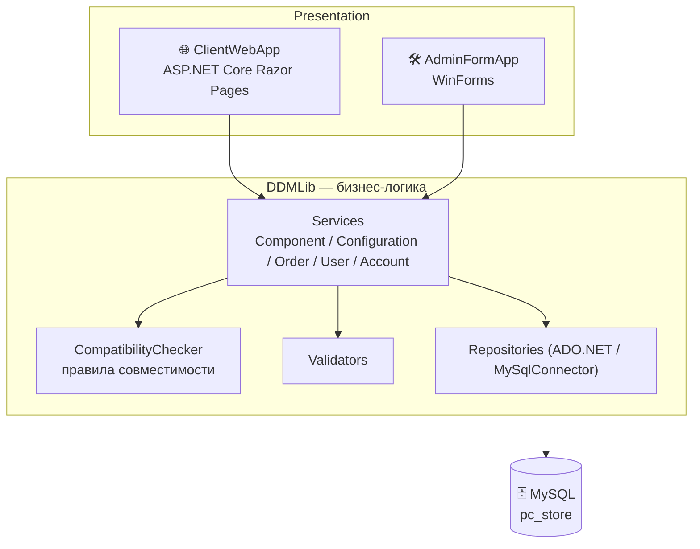
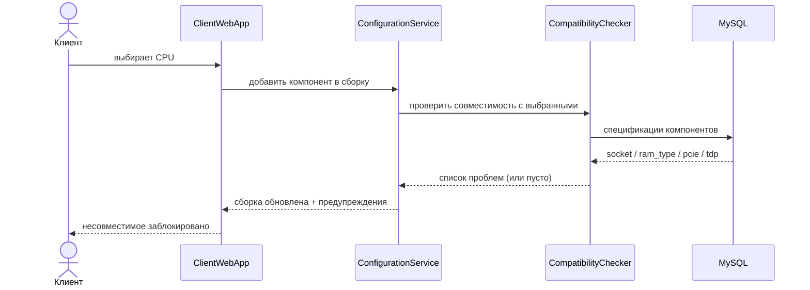
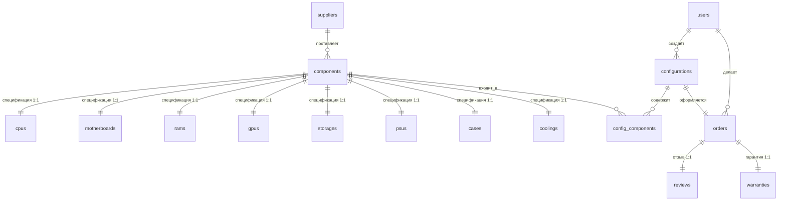

<div align="center">

# 🖥️ DDMachines

**Информационная система интернет-магазина готовых персональных компьютеров**

Магазин продаёт не отдельные комплектующие, а собранные и **гарантированно совместимые** ПК.
Клиент собирает конфигурацию в онлайн-конфигураторе, система сама проверяет совместимость,
считает цену и энергопотребление, а сотрудники ведут каталог и заказы через десктоп-админку.


</div>

---

## 📑 Содержание

- [О проекте](#-о-проекте)
- [Архитектура](#-архитектура)
- [Возможности](#-возможности)
- [Проверка совместимости](#-проверка-совместимости)
- [Технологии](#-технологии)
- [Структура репозитория](#-структура-репозитория)
- [Быстрый старт](#-быстрый-старт)
- [База данных](#-база-данных)
- [Тесты](#-тесты)
- [Статус и ограничения](#-статус-и-ограничения)

---

## 🎯 О проекте

**DDMachines** — учебная система для розничного магазина ПК. Идея бизнеса: клиент часто не
разбирается в комплектующих и боится собрать несовместимую машину. Магазин закрывает эту боль —
продаёт **только готовые сборки** с единой гарантией, а совместимость гарантирует программа.

Система состоит из двух приложений с **общей базой данных MySQL**:

| Приложение | Проект в solution | Аудитория | Технология |
|---|---|---|---|
| 🌐 Клиентский сайт | `ClientWebApp` (`WebApplication1/`) | покупатели | ASP.NET Core Razor Pages, .NET 8 |
| 🛠️ Админка (десктоп) | `AdminFormApp` (`WindowsFormsApp1/`) | менеджеры и администраторы | WinForms, .NET Framework 4.8 |
| 📦 Общая бизнес-логика | `DDMLib` | — | библиотека классов, .NET Framework 4.8 |
| ✅ Тесты | `DDMTests` | — | MSTest |

Полное описание предметной области, всех сущностей и связей БД — в файле
[`Описание..docx`](./Описание..docx).

---

## 🧩 Архитектура

Многослойная архитектура: обе UI-«головы» переиспользуют один и тот же слой логики `DDMLib`
и одну базу данных.



Внутри `DDMLib` каждый модуль устроен одинаково: `Model → Validator → Repository (интерфейс + MySQL-реализация) → Service`.
Строку подключения оба приложения читают из `config.ini` через `DDMLib/Config.cs`.



---

## ✨ Возможности

### 🌐 Клиентский сайт

| Раздел | Что делает |
|---|---|
| Регистрация / вход | создание аккаунта (email как первичный ключ), сессия |
| Личный кабинет | профиль, аватар, смена пароля, история заказов, сохранённые сборки |
| Каталог | просмотр компонентов и готовых пресетов сборок |
| Конфигуратор | пошаговый подбор с онлайн-проверкой совместимости, расчёт итоговой цены |
| Корзина и заказ | оформление, выбор способа оплаты и доставки, генерация номера заказа |
| Отзывы | оценка 1–5, текст и фото после доставки |

Страницы: `Index`, `Login`, `Register`, `Components`, `CreateConfiguration`, `EditConfiguration`,
`CreateOrder`, `Orders`, `UserProfile`.

### 🛠️ Админка (WinForms)

| Модуль | Формы | Что делает |
|---|---|---|
| Каталог компонентов | `ComponentsForms/` | CRUD по каждому типу: CPU, материнские платы, ОЗУ, GPU, накопители, БП, корпуса, охлаждение |
| Поставщики | `SupplierForms/` | справочник поставщиков комплектующих |
| Конфигуратор пресетов | `ConfiguratorForms/`, `ConfigForms/` | создание и редактирование готовых сборок-пресетов |
| Заказы | `Orders/`, `UserOrder/` | просмотр заказов, смена статуса, отметка об оплате |
| Пользователи | `UserOrder/` | карточки клиентов, модерация отзывов |

Вход — `LoginForm`, главное окно — `UpdateMainForm`.

---

## 🔧 Проверка совместимости

Ядро системы — [`DDMLib/Compatibility/CompatibilityChecker.cs`](./DDMLib/Compatibility/CompatibilityChecker.cs).

| Правило | Проверка |
|---|---|
| CPU ↔ материнская плата | одинаковый **сокет** |
| ОЗУ ↔ материнская плата | одинаковый **тип памяти** (DDR4 / DDR5) |
| GPU ↔ материнская плата | совпадение **версии PCIe** |
| Материнская плата ↔ корпус | **форм-фактор** платы помещается в корпус |
| Блок питания | мощность ≥ (TDP CPU + TDP GPU) × **1.2** (запас 20 %) |
| Охлаждение ↔ CPU | поддерживаемый TDP кулера ≥ TDP процессора |

Несовместимые позиции убираются из выдачи (`FilterCompatibleComponents`), а при попытке
добавить конфликтный компонент возвращается понятное сообщение
(`CheckCompatibilityForComponent`).

---

## 🛠 Технологии

- **Языки:** C#
- **Backend / логика:** .NET Framework 4.8 (`DDMLib`), доступ к данным — ADO.NET + `MySql.Data`
- **Веб:** ASP.NET Core 8, Razor Pages, DI-контейнер
- **Десктоп:** Windows Forms
- **БД:** MySQL 5.7+ (дамп снят через phpMyAdmin)
- **Конфигурация:** `config.ini` (`ini-parser`)
- **Тесты:** MSTest (`DDMTests`)
- **Логирование:** файловый `ErrorLogger` → `errors.log`

> ⚠️ Веб-приложение (`net8.0`) ссылается на `DDMLib` (`net48`), поэтому сборка и запуск —
> **только на Windows** с установленным **.NET Framework 4.8 Developer Pack** и .NET 8 SDK.

---

## 📂 Структура репозитория

```
DDMachines/
├── mainSolution.sln              # solution со всеми проектами
├── pc_store.sql                  # дамп БД MySQL (структура + демо-данные)
├── Описание..docx                # описание предметной области и БД
│
├── DDMLib/                       # 📦 бизнес-логика (переиспользуется веб и десктопом)
│   ├── Config.cs                 #   чтение config.ini → строка подключения
│   ├── Compatibility/            #   CompatibilityChecker — правила совместимости
│   ├── Components/               #   Case / Cooling / Cpu / Gpu / Motherboard / Psu / Ram / Storage
│   │   └── <Type>/               #     Model + Validator + IRepository + MySqlRepository + Service
│   ├── Configuration/            #   пользовательские сборки (Configuration, ConfigComponent, DTO)
│   ├── ConfigForAdmin/           #   пресеты сборок для админки (BuildService, BuildValidator)
│   ├── Order/                    #   заказы, статусы, способы оплаты и доставки (enum + extensions)
│   ├── Supplier/  User/  Session/
│   ├── AccountService.cs         #   профиль, смена пароля, аватар, logout
│   └── PhotoStorage.cs  ErrorLogger.cs
│
├── WebApplication1/              # 🌐 клиентский сайт (ClientWebApp, net8.0)
│   ├── Program.cs                #   регистрация сервисов в DI
│   ├── appsettings.json  config.ini
│   └── Pages/                    #   Index, Login, Register, Components, CreateConfiguration, Orders...
│
├── WindowsFormsApp1/             # 🛠️ админка (AdminFormApp, net48)
│   ├── Program.cs  LoginForm.cs  UpdateMainForm.cs  ThemeColor.cs
│   ├── ComponentsForms/          #   CRUD-формы по типам компонентов
│   ├── ConfiguratorForms/  ConfigForms/
│   ├── Orders/  UserOrder/  SupplierForms/
│
├── DDMTests/                     # ✅ юнит-тесты сервисов (MSTest)
│   ├── admintests/               #   тесты сервисов компонентов и поставщиков
│   └── T*Service.cs              #   Account / Component / Configuration / User
│
└── Resources/                    # иконки и логотип
```

---

## 🚀 Быстрый старт

### Требования

- Windows
- [.NET 8 SDK](https://dotnet.microsoft.com/download)
- .NET Framework 4.8 Developer Pack
- MySQL 5.7+ (например, через XAMPP / MySQL Server)
- Visual Studio 2022 (рекомендуется)

### 1. Клонировать

```bash
git clone https://github.com/ziqara/DDMachines.git
cd DDMachines
```

### 2. Поднять базу данных

```bash
mysql -u root -p -e "CREATE DATABASE pc_store CHARACTER SET utf8mb4"
mysql -u root -p pc_store < pc_store.sql
```

### 3. Прописать строку подключения

Скопировать шаблон и указать свой пароль. Файл нужен **рядом с каждым исполняемым файлом**
(шаблоны — `DDMLib/config.ini` и `WebApplication1/config.ini`):

```ini
[Database]
ConnectionString=server=localhost;user=root;password=ВАШ_ПАРОЛЬ;database=pc_store;
```

Если файла нет или строка пустая — приложение не стартует
(`Config.InitializeConfiguration()` бросает исключение).

### 4. Запустить клиентский сайт

```bash
cd WebApplication1
dotnet run
```

→ http://localhost:5078

### 5. Запустить админку

Открыть `mainSolution.sln` в Visual Studio → назначить `AdminFormApp` стартовым проектом → `F5`.
Учётная запись администратора создаётся записью в таблице `users`.

---

## 🗄️ База данных

16 таблиц, схема `pc_store`.



| Группа | Таблицы | Назначение |
|---|---|---|
| Пользователи | `users` | клиенты и администраторы (PK — `email`) |
| Каталог | `components` (+ `supplier_id`) | общий справочник товаров |
| Характеристики | `cpus`, `motherboards`, `rams`, `gpus`, `storages`, `psus`, `cases`, `coolings` | детали каждого типа, 1:1 к `components` |
| Сборки | `configurations`, `config_components` | конфигурации ПК и их состав |
| Продажи | `orders`, `reviews`, `warranties` | заказы, отзывы, гарантийные талоны |
| Закупки | `suppliers` | поставщики |

---

## ✅ Тесты

```bash
dotnet test DDMTests/DDMTests.csproj
```

Покрыты сервисы `DDMLib`: компоненты (CPU, GPU, RAM, материнские платы, БП, накопители,
корпуса, охлаждение), поставщики, пользователи, аккаунт, конфигурации.

> Тесты обращаются к **реальной БД `pc_store`** — она должна быть поднята и заполнена дампом.

---

## 📌 Статус и ограничения

Учебный проект. Осознанные упрощения:

- пароль БД и строка подключения лежат в `config.ini` в открытом виде;
- юнит-тесты не изолированы от боевой БД (нет in-memory / транзакционного отката);
- в `DDMLib` остались дублирующиеся папки (`ConfigForAdmin` / `ConfiguratorForAdminForm`) — след итераций разработки;
- смешаны целевые платформы `net8.0` и `net48`, из-за чего проект привязан к Windows.
